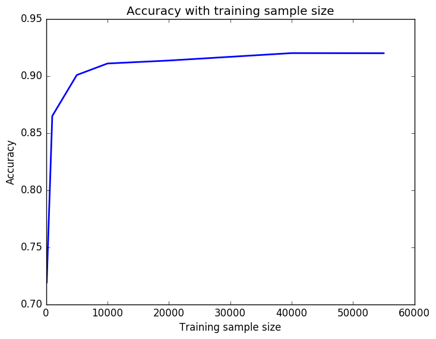
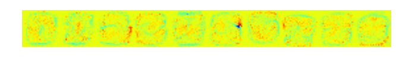

# MNIST handwritten digits classification using Logistic regression 

## Uses Scikit-learn toolbox. 

Total size of training images is  (55000)
Total size of test images is  (10000)
Maximum accuracy of about 92%

#####Accuracy with training sample size 

#####Learnt weight matrix for training sample size of 55000 

